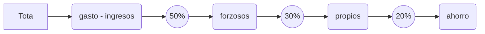

# js-matematicas-y-estadistica
Ejercicio lo aprendí en el curso práctico de JavaScript

# Bienvenidos  Economic-Wallet
En esta página web puedes sacar el porcentaje 50, 30 y 20 donde puedes ver el consumo mensual semanal o anual como mas te acomodes de gastos. Así previendo una buena economía para tus gastos.

# Introducción 
## Gastos
### 50% forzosos
	- Casa (hipoteca o renta)
	- Carro (mensualidad gasto de gasolina o refaccionaria)
	- Despensa
	- gas
	- luz
	- agua
	- internet
	- otros(puede ser cualquier gasto forzoso)
### 30% propios
	Cualquier gasto que sea por gusto o mejora.
	- ejercicio
	- platzi
	- spotify
	- netflix
### 20% ahorro
	El porcentage que es requerido ahorra por mes semana
	 o año como ustede desee.

## Procedimiento
 Seleccione el símbolo +  de agregar ya sea **gasto** o **ingreso**.
 
 En el caso de agregar **ingreso** nos pedirá **nombre** y **cantidad** aceptamos y se agregara.

En el caso de agregar **gasto** nos pedirá **nombre**,**cantidad** y **porcentaje**. El **porcentaje** es como vimos anteriormente a quien se le lo queremos asignar forzoso, propio o ahorro. Al aceptar se nos irán acumulando.

Al terminar de agregar toda la lista de **gastos** e **ingresos** nos mostrara un símbolo en el centro, que al picarle nos dará la información de la siguiente manera.

Sí llegas a tener el **total** negativo nos indicara en rojo.
Sí llegas a tener el **forzoso** mayor a el 50% del **ingreso** nos indicara en *rojo*.
Sí llegas a tener el **propio** mayor a el  30% **ingreso** nos indicara en *rojo*. 
Sí llegas a tener el **ahorro** menor a el 20% **ingreso** nos indicara en *rojo*.

Para tener una buena economía todo debe estar en *verde*.
